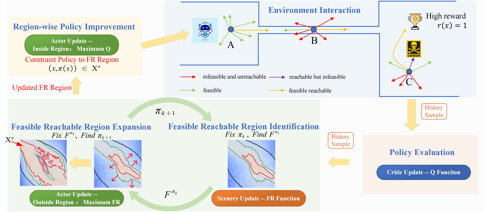

# FRPI（Feasible-Reachable-Policy-Iteration） 
The International Conference on Machine Learning (ICML), 2024

[**[Project Page]**](https://jackqin007.github.io/FRPI/) [**[PDF]**](https://openreview.net/pdf?id=ks8qSwkkuZ) [**[Openreview]**](https://openreview.net/forum?id=ks8qSwkkuZ)


The official implementation of FRPI, which **represents an efficient policy space pruning algorithm of safe reinforcement learning for goal-reaching problems with safety constraints, which achieves the best performance both in safety and return**. 

# Methods
**What is the problem?**<br>
 The goal-reaching tasks with safety constraints are common control problems in real world, such as intelligent driving and robot manipulation. The difficulty of this kind of problem comes from the exploration termination caused by safety constraints and the sparse rewards caused by goals.

**What the existing methods do?** <br>
 The existing safe RL avoids unsafe exploration by restricting the search space to a feasible region, the essence of which is the pruning of the search space. However, there are still many ineffective explorations in the feasible region because of the ignorance of the goals.

**What our methods do?** <br>
Our approach considers both safety and goals; the policy space pruning is achieved by a function called feasible reachable function, which describes whether there is a policy to make the agent safely reach the goals in the finite time domain. This function naturally satisfies the self-consistent condition and the risky Bellman equation, which can be solved by the fixed point iteration method. 


<p float="left">

</p>

**How FRPI work?** <br>
Our algorithm contains three modules to train: Actor, Critic, and Scenery. In FRPI, we train these modules in three phases: policy evaluation, region identification, and region-wise policy improvement (region expansion and policy improvement). 
At the start of training, we first collect data containing four sorts of trajectories, in which only the feasible reachable trajectory is desired. Our algorithm is built in an off-policy context to obtain higher sample efficiency. From the perspective of algorithm update, it can be divided into the following steps:

1. **Policy Evaluation**. We update the critic module, the Q-function, by the Q self-consistency condition,  which can give the expected return of the current policy.
2. **FR Region Identification**. We update the scenery module, the FR function, by introducing the FR self-consistency condition, which can identify the feasible reachable region of the current policy.
3. **FR Region Expansion and Policy Improvement**. We update the actor module by region-wise policy improvement. For the state outside the FR region, we maximize the scenery function to get a more feasible policy with a greater feasible reachable region;  for the state inside the region, we maximize the value function to get a higher return policy.

Convergence of FRPI requires convergence of both regions and policies. The core step is the learning process of region, which contains both region identification and region expansion. In the FR region identification, we fix the policy function and update the FR function by feasible reachable self-consistent condition. In the FR region expansion, we fixed the scenery function to find a better policy by promoting feasible reachability outside the region. Once the FR region is given, we can efficiently improve the return within the region to find the optimal policy that satisfies the feasible reachability constraint.


## The comparison of the time in training 
Only one more scenery module, a simple MLP module that is easy to compute, was added to the FRPI framework. The result showed that the computational cost of the scenery module update is similar to that of the critic module. The time consumption experiment also showed that no additional computational burden was added. Furthermore, benefiting from the further pruning structural design, we achieved better or comparable convergence computer time consumption than SAC. 
The configuration is NVIDIA GPU3090; we train by JAX and set XLA_PYTHON_CLIENT_MEM_FRACTION=0.1(2720MB GPU).

| Algorithm     | FRPI-SAC | FPI-SAC | RAC   | SAC-Lag | SAC   |
|---------------|----------|---------|-------|---------|-------|
| Inference Time (ms) | 1.576    | 1.573   | 1.589 | 1.742   | 0.983 |


| Convergence time(s) | PointGoal | PointPush | CarGoal | CarPush |
|-----------|-----------|-----------|---------|---------|
| FRPI-SAC  | **2.0K**      | **4.5k**      | **2.2K**    | **8.6k**    |
| SAC       | 2.5K      | 4.6k      | 2.3K    | 9.3k    |
| SAC-Lag   | 7.3K      | 15.2k     | 5.5K    | 30.0k   |
| FPI-SAC   | 6.2K      | 12.3k     | 5.3K    | 20.7k   |
| RAC       | 4.8K      | 8.3k      | 5.6K    | 14.2k   |
>The table shows the number of interactions required to reach the specified bar (as shown in Figure 10), measured in millions of samples.

## Quick Start
```bash
# Create environment
conda create -n FRPI python=3.9 numpy matplotlib tensorboard tensorboardX cyipopt pandas
conda activate FRPI
# One of: Install jax WITH CUDA
pip install --upgrade "jax[cuda]" -f https://storage.googleapis.com/jax-releases/jax_cuda_releases.html
# Or: Install jax WITHOUT CUDA
pip install --upgrade "jax[cpu]"
# install FRPI
pip install -e .
```

## Bibtex

If you find our code and paper can help, please cite our paper as:
```
@inproceedings{qinfeasible,
title={Feasible Reachable Policy Iteration},
author={Qin, Shentao and Yang, Yujie and Mu, Yao and Li, Jie and Zou, Wenjun and Li, Shengbo Eben and Duan, Jingliang},
booktitle={Forty-first International Conference on Machine Learning},
year={2024},
url={https://openreview.net/pdf?id=ks8qSwkkuZ}
}
```


